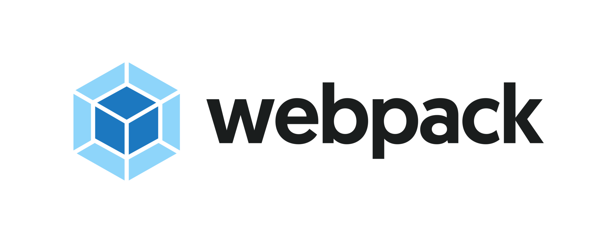

<h1>стартовый Webpack шаблон</h1>

<h2>Как пользоваться</h2>
<ul>
	<li>npm run build - Для того чтобы собрать проект</li>
	<li>npm run dev - хот релоад на localhost:8080</li>
</ul>
<h2>Подключение прочего</h2>
<h5>Jquery</h5>

Прописать "npm i jquery (--save опционально)" в файле <i>/src/index.js</i> раскомментировать 3 строку

<h5>Bootstrap 4</h5>

Прописать "npm i bootstrap (--save опционально)" в файле <i>/src/index.js</i> раскомментировать 2 строку

